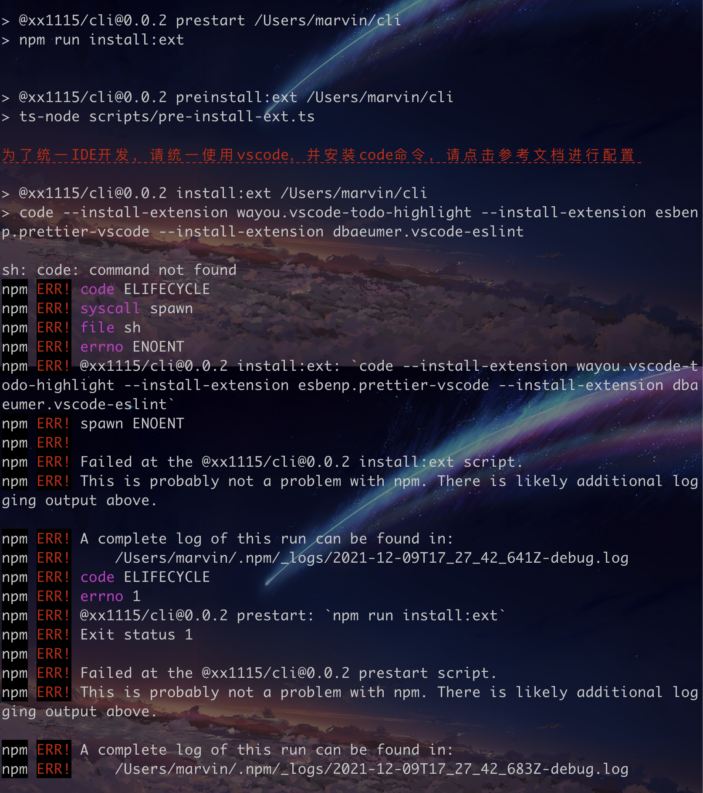
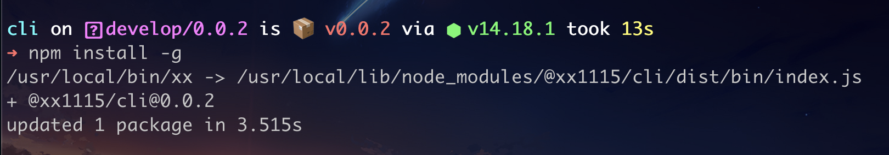
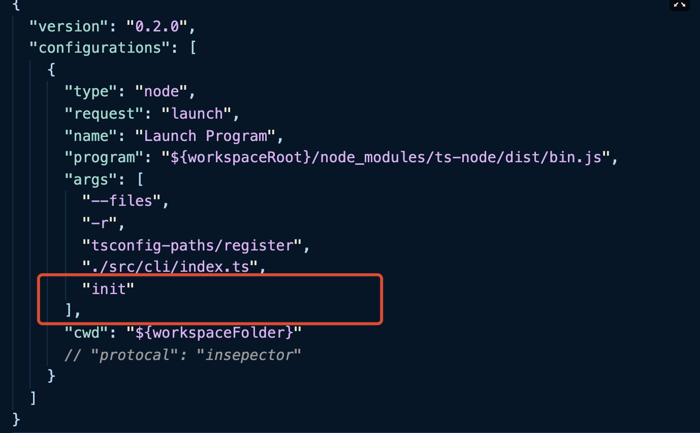
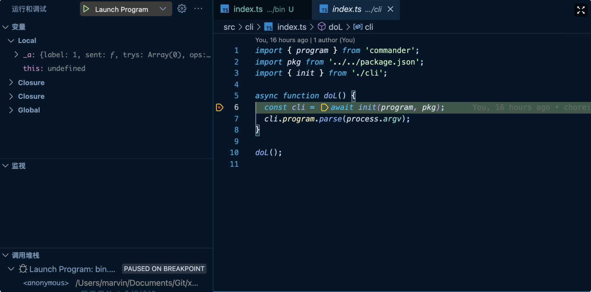
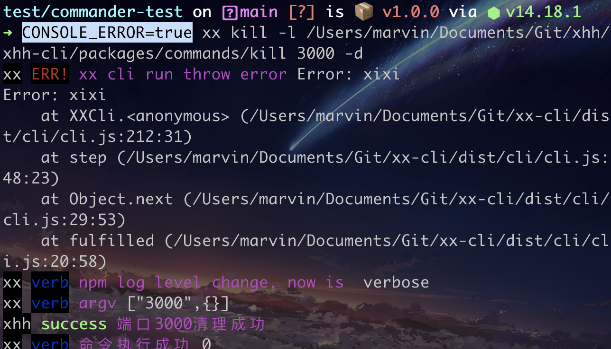

# 本地开发

## 准备


### 下载源码

```bash
git clone git@github.com:xx1115/cli.git
```


### 安装

```bash
cd cli
npm install
```


> 为了保证开发环境的统一，我们在 start 命令前加入了`hook`，会去安装一些`vscode`的拓展插件，前提是先将`code`安装到环境变量中，可以执行`npm start`根据提示进行安装。





### 关联 cli 命令

- 执行`npm start`命令进行编译，此时在根目录下会产生`dist`文件夹
- 在根目录下执行 `npm install -g`


成功后会打印类似如下的信息




使用`xx -h`来查看命令是否可以正常使用。

```bash
➜ xx -h
Usage: xx <command> [options]

A scaffolding for an engineered solution

Options:
  -d, --debug          Whether to enable debugging mode (default: false)
  -l, --local <local>  Specify the local debug file path (default: "")
  -V, --version        output the version number
  -h, --help           display help for command

Commands:
  init [options]       Initialize a project
  create [options]     Create a project
  commit [options]     handle git flow
  publish [options]    publish project
  kill <port>          Kills the port number of the corresponding process
  help [command]       display help for command
```

## 调试

### console.log模式

在使用`npm start`的时候我们已经对`src`文件夹进行了监听，当有文件修改时会进行重新编译，此时我们只要去直接修改代码，tsc就会帮我们把最新的文件构建到dist目录下，在需要的地方添加console.log打印相关信息即可。

### debug模式

我们使用了vscode提供的debug功能，在根路径下会有一个.vscode/launch.json文件，我们只要在“args”字段中添加调试参数，然后回到项目中去打入断点，使用F5按钮启动即可，如下面的图，当出现这样的窗口代表着调试功能开启成功。





### 显示错误堆栈信息

为了使cli的打印信息变得干净，目前仅使用了npmlog的log.error函数，但是我们并没有打印错误的堆栈信息。如果在开发过程中需要打印错误堆栈信息，则需要设置环境变量。

如下，在执行xx命令前添加环境变量`CONSOLE_ERROR=true`


